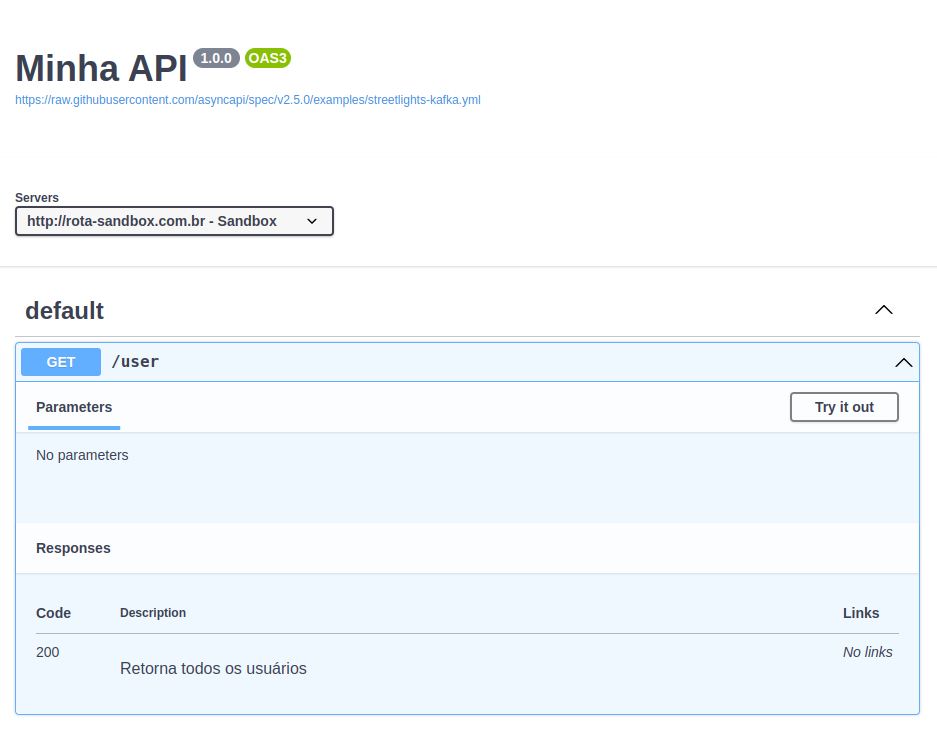

# Como documentar uma API Rest com OpenAPI/Swagger

## 0. Antes de começar

### Pré-requisitos

- Saber como trabalhar com um arquivos JSOM.

### Ferramentas

- Para visualizar a lib [Swagger UI](https://swagger.io/tools/swagger-ui/) ou pela minha recomendação, [editor online](https://editor-next.swagger.io/) oficial disponibilizado pela equipe criadora do Swagger.

Para facilitar a navegação e exemplificação dos códigos, agrupei ada exemplo em um menu toggle, e os mapei no formato {Tipo}{Tópico}.{Numeração}, sendo `E` para o tipo `Estrutura` e `G` para o código `Geral`.
Exemplo: G1.1 para o primeiro código geral do tópico 1.

## 1. Estrutura base

Esta é a estrutura minima para a construção de uma documentação através da ferramenta OpenAPI ( G1.1 ).

<details>
<summary>G1.1 Estrutura base</summary>

```json
{
  "openapi": "3.0.3",
  "info": {
    "title": "Minha API",
    "version": "1.0.0"
  },
  "paths": {}
}
```

</details>

O Boiler plate consiste nos campos:

- openapi: Determina qual a versão do OpenApi está sendo usada
- info: Campo destinado a algumas informações sobre a api, como:
  - title: Título da API/Documentação
  - version: Versão da API
- paths: Neste compo, posteriormente iremos incluir as rotas da API

## 2. Construção de rotas

### 2.1 Servidores

É bem comum que produtos rodem a mesma API em Urls diferentes a fim de separar os ambientes de teste e produção ou para disponibilizar uma sandbox para que os usuários possam testar a API sem interferir no funcionamento da API principal(produção). A primeira coisa que iremos fazer é determinar quais são os servidores base da nossa API.

No nosso boiler plate (G1.1), iremos adicionar o parâmetro `servers`, sendo este responsável por informar onde a nossa API irá rodar.

<details>
<summary>E2.1.1</summary>

```json
  "servers": [
    {
      "url": "http://rota-sandbox.com.br",
      "description": "Sandbox"
    }
  ]
```

</details>

Juntando ao nosso boiler plate temos:

<details>
<summary>G2.1.2</summary>

```json
{
  "openapi": "3.0.3",
  "info": {
    "title": "Minha API",
    "version": "1.0.0"
  },
  "servers": [
    {
      "url": "http://rota-sandbox.com.br",
      "description": "Sandbox"
    }
  ],
  "paths": {}
}
```

</details>

> Como é possível perceber, `servers` é um array, ou seja, é possível adicionar mais de um servidor para ser exibido ao leitor da documentação

### 2.2 Rotas

Dentro do parametro `paths` já criado anteriormente em G1.1, iremos adicionar a rotas existentes na nossa API.

Os caminhos seguem o formato E2.2.1

<details>
<summary>E2.2.1 Estrutura base rotas</summary>

```json
{
  "/{rota}": {
    "{método HTTP}": {
      "responses": {
        "{HTTP status}": { "description": "{descrição}" }
      }
    }
  }
}
```

Exemplo:

```json

  "/user": {
    "get": {
      "responses": {
        "200": { "description": "Retorna todos os usuários" }
      }
    }
  }

```

</details>

Este é o menor detalhamento para uma rota possível, onte temos os parâmetros:

- rota: Caminho da rota após a URL base.
- método HTTP: Qual o método correspondende à rota ( GET, POST, PUT... )
- responses: Campo destinado aos possíveris retornos da rota

  - HTTP status: Status da resposta previsto ( 200, 201, 400, 404... )
    - description: Uma descrição sobre o retorno da rota

Somando ao estrutura geral que temos até agora, teremos algo parecido com:

<details>
<summary>G2.2.2</summary>

```json
{
  "openapi": "3.0.3",
  "info": {
    "title": "Minha API",
    "version": "1.0.0"
  },
  "servers": [
    {
      "url": "http://rota-sandbox.com.br",
      "description": "Sandbox"
    }
  ],
  "paths": {
    "/user": {
      "get": {
        "responses": {
          "200": { "description": "Retorna todos os usuários" }
        }
      }
    }
  }
}
```

</details>

Se você está usando o [editor online](), deve ter obtido algo parecido com isto:



### 2.3 Detalhamento
